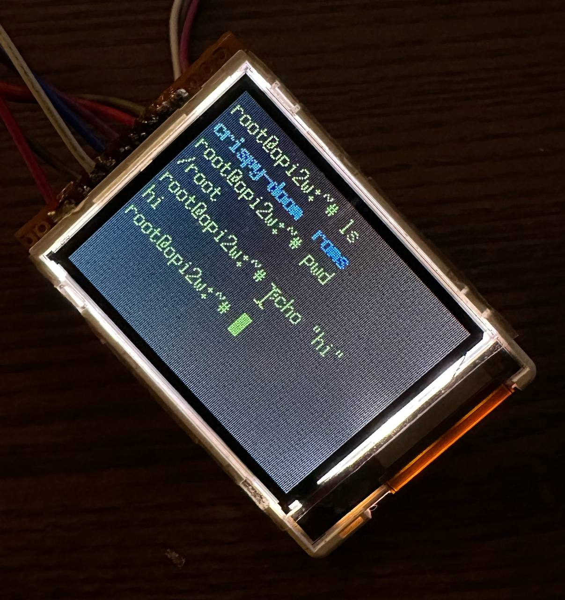

# LS020 Display Driver

Linux framebuffer driver for Siemens S65 LS020 TFT LCD display. Cross-platform, Native and Fast



## Features

- Cross-platform. Module uses Linux GPIO and SPI subsystems instead of platform specific
- Blazing fast framebuffer management with native Linux support
- Adjustable refresh rate (1-120 FPS), very good on 40-60
- X11 compatibility (see scripts to run X server)
- Device Tree supported

## The Display

- **Resolution:** 176x132 pixels 
- **Color:** 16-bit RGB565
- **Interface:** SPI, 65 MHz

## Installation

```bash
# Compile driver
make

# Load driver  
sudo insmod ls020_fb.ko
```

## Parameters

- `rotation`: Display orientation (0-3, default: 0)
- `fps`: Refresh rate (1-120, default: 60) 
- `partial_update`: Enable partial updates (default: true)

Example:
```bash
sudo insmod ls020_fb.ko rotation=0 fps=40
```

## Device Tree

Add to your device tree:
```dts
&spi0 {
    ls020@0 {
        compatible = "siemens,ls020";
        reg = <0>;
        spi-max-frequency = <30000000>;
        ls020-reset-gpios = <&pio 8 8 GPIO_ACTIVE_HIGH>;
        ls020-dc-gpios = <&pio 8 7 GPIO_ACTIVE_HIGH>;
    };
};
```

## Usage

### X11  
```bash

sudo apt install apt install xserver-xorg-core xorg xserver-xorg-video-fbdev
cd scripts/
./start_xorg.sh

sudo apt install xterm
DISPLAY=:1 xterm &
```

### Gaming
```bash
sudo apt install xterm
DISPLAY=:1 retroarch --config etc/retroarch.cfg
```
